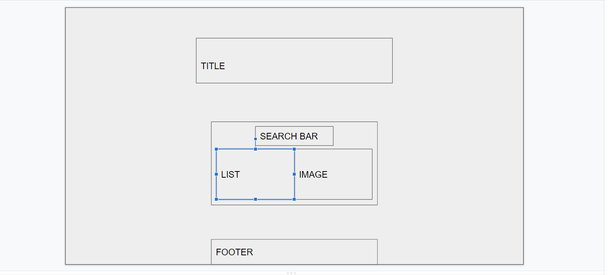
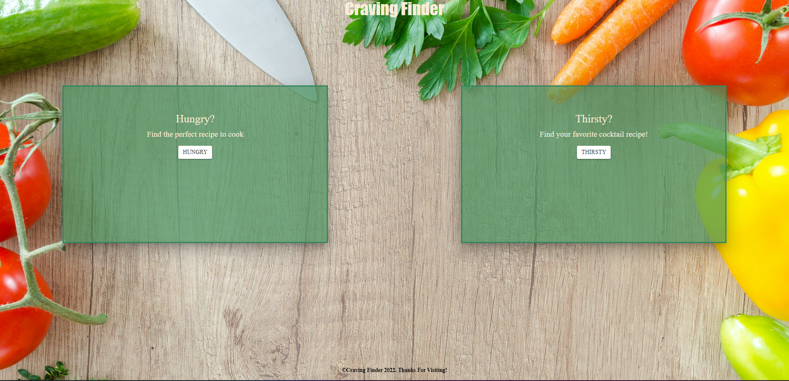

# GROUP 7 PROJECT
- [GROUP 7 PROJECT](#group-7-project)
  - [CRAVING FINDER](#craving-finder)
    - [USER STORY](#user-story)
    - [TECHNOLOGIES USED](#technologies-used)
    - [ROLES](#roles)
    - [CHALLENGES](#challenges)
    - [DEPLOYED LINK](#deployed-link)
    - [MOCK UP](#mock-up)
    - [SCREENSHOT](#screenshot)
## CRAVING FINDER

### USER STORY
I want a quick way to look up ingredients that I'll need for any given recipe
So that i don't need to waste time reading through a recipe websites that always seems to put the author's life story before the actual recipe.
*   Given the name of a food or drink item 
    - When I search that  food or drink name
        - Then I'll get the ingredient list I'll need 

### TECHNOLOGIES USED
- HTML
- CSS
- BOOTSTRAP
- MATERIALIZE
- JAVASCRIPT
- JQUERY
- API

### ROLES
- HTML - Osman
- CSS - Christina
- JS/JQuery - Nicholas
- Research - Matt

### CHALLENGES
- API Functionality
  - Finding an API that will provided what we needed, without paying
- Coordination
- Merge Conflicts
  - learning to pull before working in a branch
  - Branches not updating
- Accepting limitations and pivoting ideas
  - We couldn't do the originally planned site because of the limitations to free API's. 
  
### DEPLOYED LINK
https://niccarrig.github.io/cravings/food.html

### MOCK UP

### SCREENSHOT

