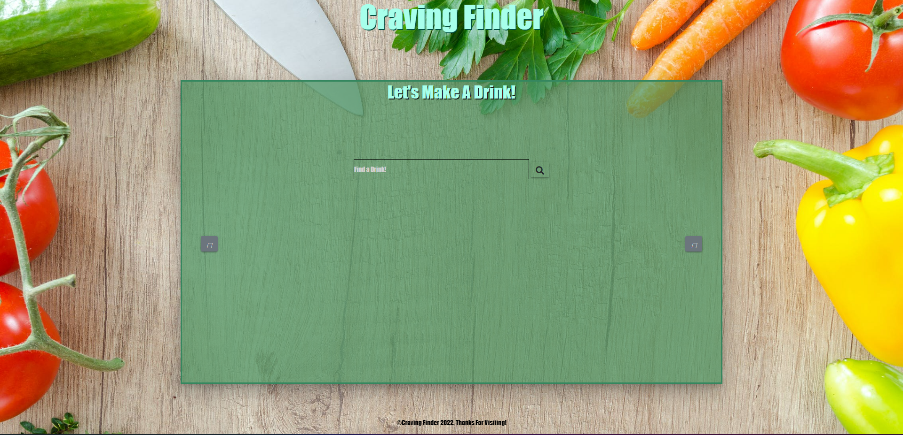

# GROUP 7 PROJECT
## CRAVING FINDER
The goal of this project was to create a website that allowed you to find ingredients for a food or drink that you type into the search bar.
### DEPLOYED LINK
https://niccarrig.github.io/cravings/food.html

### SCREENSHOT

### USER STORY
When the user first enters the site, they will will have the option to choose if they would like a food or a drink. Once the corresponding button is click with user will be directed to a search page for either food or drinks. Once the user enters their choice and the search button is clicked, the page should then display the name, list of ingredients, and image of the closest match for that search. If there are additional options for the search the user can switch between them using the arrow buttons on the side.
### MOCK UP

### TECHNOLOGIES USED
- HTML
- CSS
- BOOTSTRAP
- MATERIALIZE
- JAVASCRIPT
- JQUERY
- API

### ROLES
- HTML - Osman
- CSS - Christina
- JS/JQuery - Nicholas
- Research - Matt

### CHALLENGES
- API Functionality
  - Finding an API that will provided what we needed, without paying
- Coordination
- Merge Conflicts
  - learning to pull before working in a branch
  - Branches not updating
- Accepting limitations and pivoting ideas
  - We couldn't do the originally planned site because of the limitations to free API's. 
  

